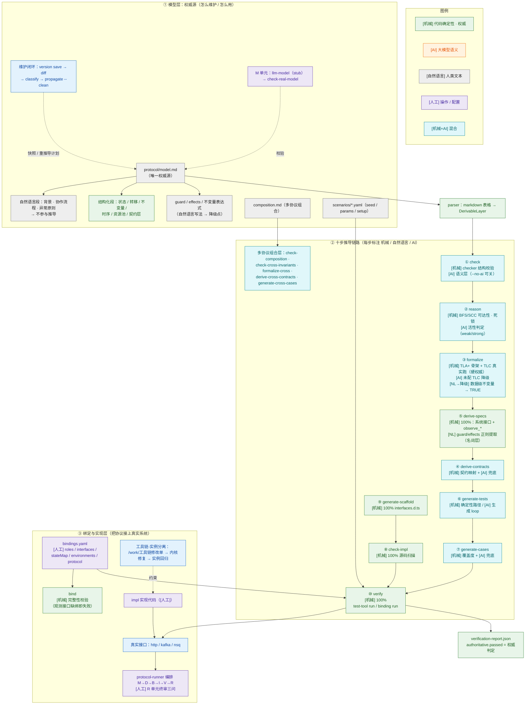

# Protochain 核心价值与核心目标

> 版本：v0.3（2026-08-22）
> 范围：定位 protochain 是什么、要解决什么问题、核心机制是什么、当前缺什么
> 读者：工具链维护者、首次接触协议的工程师、评估是否引入该工具链的架构师

---

## 0. 一句话定位

**Protochain 是一套"以协议模型为唯一权威源"的工具链，通过机械推导把同一份 model.md 反复投射出：可形式化证明的规格、可执行的测试工具、可绑定真接口的契约、可作为实现骨架的类型**——让"系统怎么运转"在工具链层面被强制维护，而不是靠文档与人肉 review。

---

## 1. 现状与目标

### 1.1 现状：protochain 当前是什么（代码事实层）

本节描述工具链截至 v0.1.0（2026-08）的**代码事实**，回答"今天能做什么"；§1.2 给出"现状与目标的差距"。

**形态**：TypeScript 实现的 CLI（`protochain` v0.1.0，`npm run build` 编译，入口 [src/cli/index.ts](file:///work/protochain/src/cli/index.ts)），约 25 个顶层命令、50+ 源码模块，无运行时服务端依赖（TLC 需外部 tla2tools.jar，可选）。

**命令面（按功能域）**：

| 功能域 | 命令 | 落地状态 |
|---|---|---|
| 初始化 | `init` / `init-multi` / `init-runner` | 单协议 / 多协议 / protocol-runner 编排实例三类骨架 |
| 十步流程 | `check` `reason` `formalize` `derive-specs` `derive-contracts` `generate-tests` `generate-cases` `generate-scaffold` `check-impl` `verify` | 全部可执行（机械/AI 分布见 §3） |
| 组合层 | `check-composition` `check-cross-invariants` `formalize-cross` `derive-cross-contracts` `generate-cross-cases` | 多协议跨协议链路 |
| 编排 | `run` / `status` / `exec-task` | DAG 执行 / 进度查看 / protocol-runner 子任务模式 |
| 绑定 | `bind` / `verify --env` | 绑定完整性校验 / 多环境切换 |
| 版本 | `version save/list/show/classify` / `diff` / `impact` / `propagate` | 快照、差分、影响分析、传播计划 |
| 配置 | `config get/set` | YAML 配置管理 |

**传输层**：`http`（P0 已实现）、`kafka` / `nsq`（P1 已实现，支持 none / reply_topic / poll 三响应模式 + SASL / nsqlookupd）、`db_query` / `grpc`（计划中，当前返回 501）。

**集成面**：
- **TLC 真实模型检查**：配置 `tlc` 段（portable JRE + tla2tools.jar）后 `formalize` 真实跑 TLC，反例/超时/解析失败均为权威失败，不静默降级 AI
- **protocol-runner 集成**：`init-runner` 生成 M→D→B→I→V→R 六单元编排实例（[templates/protocol-runner-instance/project.yaml](file:///work/protochain/templates/protocol-runner-instance/project.yaml)）；`exec-task` 消费结构化任务、回传 effects/facts/cost 回执，含预算硬限制
- **AI 多模型路由 + 生成 loop**：semantic/reasoning/generation 三角色路由；生成类步骤支持"生成→机械预检→修正→重试"loop（[src/ai/generation-loop.ts](file:///work/protochain/src/ai/generation-loop.ts)，硬预算 maxIterations/maxTokens/maxToolCalls）
- **绑定运行时**：场景 `setup` 段、运行时参数三级注入（场景 params > 动作响应注入 > currentState）、`stateMap` 状态词归一化、`environments` 多环境 + `--env`、多协议 binding `protocol` 隔离、环境变量前置扫描（`derived/env-deps.json`）

**实例证据**：strangler-fig（绞杀者迁移）与 hsk-ng（多协议）两个实例已跑通全链路；工具链自身修复（数据级不变量降级、活性弱模式、test-tool 可执行契约、场景 setup）均由实例反馈→修改单闭环驱动（/work 下已归档 001/002/003 三份修改单）。

### 1.2 现状 → 目标的差距：已达成 vs 未达成

| 目标维度 | 现状达成度 | 主要未达成点 |
|---|---|---|
| 状态机结构机械推导 | ✓ 达成（check / derive-specs / generate-scaffold / check-impl / verify 纯机械） | — |
| 形式化证明 | ◐ 部分（配置 TLC 后 `toolExecuted=true` 为硬权威） | 未配置 TLC 时降级 AI 推演；数据级不变量全部降级 `TRUE`（§4.3） |
| 契约完整性 | ✗ 未达成 | specs.json 无 JSON Schema，推导停在名词层（§4.1） |
| 可执行测试 | ◐ 部分（test-tool 编译加载 + 契约校验） | 验证权威性受生成质量影响（§4.5） |
| 可观测性同源 | ✓ 达成（`observe_*` 与系统接口同源推导、`bind` 强制绑定观测接口） | 仅状态/不变量两类观测，无业务指标观测 |
| 工具链-实例分离 | ✓ 达成（修改单纪律 + 实例严禁改内核） | 跨实例聚合 / 维护者 SLO / CI 联动缺失 |
| M 单元语义闸门 | ✗ 未达成（llm-model 为 stub） | 模型权威性的最大漏洞（§4.4） |

### 1.3 核心目标：单一权威源 → 多形态机械推导

protochain 的**唯一根本目标**可以归纳为一句话：

> **让"系统协议"作为一个核心模型存在，所有下游产物（接口、测试、实现、验证）都是这个核心模型的机械推导结果，权威性从模型继承、不允许出现与模型不一致的下游产物。**

这个目标对应的"核心模型 + 推导产物"图谱：

```
                  ┌─────────────────────┐
                  │   protocol/model.md │   ← 核心模型（唯一权威源）
                  │   + composition.md  │
                  └──────────┬──────────┘
                             │
        ┌────────────────────┼─────────────────────┐
        │                    │                     │
        ▼                    ▼                     ▼
  可形式化证明的         可执行的测试工具        可绑定真接口的契约
  规格产物                产物                   + 骨架产物
        │                    │                     │
        ▼                    ▼                     ▼
  ┌──────────┐         ┌──────────┐         ┌──────────┐
  │ TLA+规格  │         │ test-tool │         │ specs    │
  │ + 报告    │         │ 4 文件    │         │ + bindings│
  │          │         │ + 执行器   │         │ + scaffold│
  └──────────┘         └──────────┘         └──────────┘
        │                    │                     │
   机械可证明            机械可执行             机械可对接真接口
        │                    │                     │
        └────────────────────┼─────────────────────┘
                             ▼
                  ┌─────────────────────┐
                  │ verify 一致性验证   │
                  │ authoritative.passed │
                  └─────────────────────┘
```

### 1.4 三类推导产物的形态

| 产物形态 | 例子 | 受众 | 权威性 |
|---|---|---|---|
| **人肉可审核** | `derived/specs.json`、`derived/contracts.json`、`derived/composition/*`、`interfaces.d.ts` | 协议作者、实现者 | 与模型一致即权威；不一致即 bug |
| **机械可验证** | `TLA+ formal/*`、`completeness-report.json`、`coverage report` | 工具链、CI | 自身产出即权威（TLC/report） |
| **可机械执行** | `derived/test-tool/*.ts`、`derived/test-cases.json`、`derived/verification/verification-report.json` | 流水线、CI | 执行结果即权威 |

**所有推导产物的权威性都继承自 model.md——这是 protochain 与 "OpenAPI + Swagger UI + Postman + 手写 mock" 的根本差异**。

### 1.5 推导必须可机械的边界

不是所有东西都要机械推导，但**派生关系必须是明确的**：

- 模型层事实（状态机、不变量、转移、角色）→ 100% 机械推导
- 模型层描述（背景、协作流程、异常处理原则）→ 自然语言，工具链不推导
- 模型层声明但属数据级（如数据级不变量 forall 表达式）→ 当前工具链不推导，降级为 `TRUE`（这是边界，下文 §4 详述）

### 1.6 全链路逻辑图（模型维护 · 自然语言环节 · 机械推演）

```
图例： [机械] 代码确定性执行（权威、可复现）   [AI] 大模型处理自然语言   [自然语言] 人类文本（工具不推导）
       [人工] 人类操作/配置   [工具] 机械管理命令
════════════════════════════════════════════════════════════════════════════════════════════════

┌─ ① 模型层：权威源（怎么维护 / 怎么用）────────────────────────────────────────────────────────────┐
│                                                                                                    │
│  protocol/model.md  ←── [人工] 编写 / 编辑                                                        │
│    ├─ [自然语言] 段：背景 · 协作流程 · 异常处理原则 ──→ 不参与推导（仅供人读 + AI 语义层参考）      │
│    └─ [结构化] 段：状态空间 / 转移规则 / 不变量 / 时序约束 / 异常路径 / 资源池 / 外部事件 /          │
│                    附属实体 / 消极保证 / 契约层                                                   │
│        └─ guard / effects / 不变量表达式 若用 [自然语言] ──→ 推导降级点（见 ②）                   │
│                                                                                                    │
│  composition.md（多协议组合层）        scenarios/*.yaml（场景 seed / params / setup）             │
│                                                                                                    │
│  [工具] 维护闭环：version save ─→ diff ─→ version classify ─→ propagate --clean                   │
│          （快照）        （结构化差分）   （[AI] 范式重协商 vs 协议微调） （stale 清理+增量重推导计划）│
│  M 单元（protocol-runner 编排）：llm-model [stub] ─→ check-real-model.mjs（仅校验存在+版本）       │
└────────────────────────────────────────┬───────────────────────────────────────────────────────────┘
                                         │ [机械] parser：markdown 表格 → DerivableLayer（states/transitions/invariants）
                                         ▼
┌─ ② 十步推导链路（完整链条：每步标注 机械 / 自然语言 / AI）──────────────────────────────────────────┐
│                                                                                                    │
│  ① check          [机械] checker 结构/引用/完整性校验     [AI] checker-ai 语义层（--no-ai 可关）    │
│  ② reason         [机械] reasoner BFS/SCC 可达性·死锁     [AI] 活性判定（weak / strong 模式）       │
│  ③ formalize      [机械] formalizer：TLA+ 骨架 + TLC 真实跑（toolExecuted=true = 硬权威）           │
│                   [AI] 未配 TLC 时降级推演   [自然语言→降级] 数据级不变量表达式 → TRUE              │
│  ⑤ derive-specs   [机械] specifier 100%：action→系统接口 / state·INV→observe_* 观测接口           │
│                   [自然语言] guard/effects 文本 → 正则提取参数（只到"名词层"，无 JSON Schema）       │
│  ④ derive-contracts  [机械] 契约映射 + [AI] 兜底                                                    │
│  ⑥ generate-tests    [机械] 确定性模板路径 / [AI] 生成 loop（useForGeneration + 硬预算）           │
│  ⑦ generate-cases    [机械] generateCases（state/transition/path 覆盖）+ [AI] generateCasesWithAI │
│  ⑨ generate-scaffold [机械] scaffolder 100%（interfaces.d.ts）                                     │
│  ⑧ check-impl        [机械] implcheck 100%（扫描实现源码）                                         │
│  ⑩ verify            [机械] verifier 100%（test-tool run / binding run 双路径）                    │
│                                                                                                    │
│  多协议组合层：[机械+AI] check-composition · check-cross-invariants · formalize-cross ·             │
│              derive-cross-contracts · generate-cross-cases                                        │
└────────────────────────────────────────┬───────────────────────────────────────────────────────────┘
                                         ▼
┌─ ③ 绑定与实现层（把协议接上真实系统）──────────────────────────────────────────────────────────────┐
│                                                                                                    │
│  bindings.yaml  [人工] roles（baseUrl / auth / 令牌环境变量）· interfaces（transport）·             │
│                        stateMap（状态词归一化）· environments（多环境）· protocol（多协议隔离）      │
│  bind           [机械] 完整性校验（系统接口 + 观测接口缺绑即 valid=false）                          │
│                                                                                                    │
│  verify（binding run）→ 真实接口 http / kafka / nsq  ⇄  impl 实现代码 [人工]                       │
│      [机械] 运行时参数三级注入：场景 params > 动作响应注入 > currentState                          │
│      [机械] stateMap 归一化：协议状态 ID ↔ 系统状态值                                              │
│                                                                                                    │
│  protocol-runner 编排：M→D→B→I→V→R（enterGuards / rollbackMap / selfCheck；R 单元终审三问 [人工]） │
│  工具链-实例分离：[人工] 实例禁止改内核；工具链缺陷 → /work/工具链修改单 → 内核修复 → 实例回归       │
└────────────────────────────────────────────────────────────────────────────────────────────────────┘
```

**Mermaid 交互版**（在支持 Mermaid 渲染的预览器中查看；节点配色即类别，点击十步节点可跳转对应源码）：



**自然语言涉及点 vs 机械推演点速查**

| 环节 | 类别 | 说明 |
|---|---|---|
| model.md 描述段（背景/协作流程/异常原则） | [自然语言] | 工具链不推导，仅供人读 + AI 语义层参考 |
| guard / effects / 不变量表达式（自然语言写法） | [自然语言]→[机械降级] | formalize 降级 `TRUE`；specifier 正则提取（只到名词层） |
| check 语义层 | [AI] | `--no-ai` 可关闭，机械层不受影响 |
| reason 活性判定 | [机械] + [AI] | BFS/SCC 机械，活性判定靠 AI（weak/strong） |
| formalize | [机械]（权威） | 配置 TLC 后 `toolExecuted=true` 为硬权威；未配降级 AI |
| derive-contracts | [机械] + [AI] | 机械映射为主，AI 兜底 |
| generate-tests / generate-cases | [机械] + [AI] | 默认确定性路径；`useForGeneration` 开启 AI 生成 loop |
| derive-specs / generate-scaffold / check-impl / verify / bind | [机械] 100% | 纯代码确定性，无 AI |
| version classify / diff | [机械] + [AI] | 结构化差分机械；变更分类由语义模型判定 |
| bindings.yaml / impl 实现代码 | [人工] | 人类配置与实现，是"自然语言→系统"的最后落点 |

**模型维护闭环（关键动作）**：改 model.md → `version save` 留快照 → `check` 校验 → 需要时 `diff`/`classify` 判定变更语义 → `propagate --clean` 清理 stale 产物并生成增量重推导计划 → 按计划重跑受影响步骤 → `verify` 回到权威判定。

---

## 2. 核心价值：七条

七条核心价值按"是否被低估"排序——前两条（可执行契约 + 工具链实例分离）是真正让 protochain 区别于普通 spec-as-code 工具的关键。

### V1. 状态机级别的"可执行契约"——模型即证明对象 ★★★★★

**价值陈述**：把"协议"从"人阅读的 markdown"变成"机器可推理、可形式化证明、可覆盖度统计的对象"。

**现状证据**：`check` / `reason` / `formalize` 均已落地——[checker](file:///work/protochain/src/checker/index.ts) 机械层 + [reasoner](file:///work/protochain/src/reasoner/index.ts) BFS/SCC（可达性/死锁机械判定、活性弱/强模式）+ [formalizer](file:///work/protochain/src/formalizer/index.ts) TLA+ 生成 / TLC 真实跑；strangler-fig 019 单 P7 通过 TLC 检查、hsk-ng 多协议全绿。

**机制**：
- `parser` 把 markdown 表格抽成 `DerivableLayer`（states/transitions/invariants）
- `formalizer` 生成 TLA+ → `tlc` 真实跑模型检查，报告 `toolExecuted=true && passed=true` 是**硬权威**
- `reasoner` 做 BFS/SCC（可达性/死锁/弱活性/一致性）
- `casegen` 算 stateCoverage/transitionCoverage

**实际价值**：
- 协议改动 3 分钟跑一遍 `reason + formalize`，能告诉你"模型内部不一致"——这是普通 PR review 做不到的（结构错误如"转移 T11 的 from 含 PS1 但 PS1 在另一个 instanceStates 子图"人眼很难发现）
- strangler-fig 019 单 P7 model.md 0.1.1 通过 TLC 1 invariant 检查、hsk-ng 多协议全绿 = 模型层真有强制兜底

### V2. 工具链-实例分离 + 修改单纪律（分布式工具演进护城河） ★★★★★

**价值陈述**：**protochain / protocol-runner / strangler-fig** 三者独立演进；缺陷不会传播失控；内核演进有事实上的优先级排序。

**现状证据**：/work 下已归档 001/002/003 三份工具链修改单（reason SE 不可达、formalizer ID 转义、casegen 子状态机），实例侧未改内核源码。

**机制**：
- `/work/工具链修改单-NNN-*.md` + `/work/工具链问题清单-*.md` 三段式
- 实例侧严禁改内核源码（operations.md §5 纪律）
- 工具链缺陷必须走修改单 + 落清单 + 标记修复状态
- 修改单流程与版本控制解耦（protochain.config.yaml 含密文被 gitignore 不影响修改单追踪）

**实际价值**：
- 19 个变更单 × 7 协议 = 大量 model 扩面 → 工具链缺陷自然暴露 → 走修改单 → 工具链修复后所有实例受益
- 012/024/025/026 等 PITFALLS 是真实问题，不是 demo 数据
- 普通 spec-as-code（OpenAPI/AsyncAPI）工具没有这个分离层：发现工具 bug 要么提 issue 等官方（无 SLA）、要么 fork（分裂）

**当前问题**：
- 跨实例聚合缺失（hsk-ng 与 strangler-fig 报的修改单是否重复？没索引）
- 维护者 SLO 缺失（修改单多久必须响应？没机制）
- CI 联动缺失（修完到 hsk-ng 跑回归是手动的）

### V3. 双跑对账能力（绞杀者模式的工程化基础） ★★★★

**价值陈述**：**同一份 model + tests + scenarios + bindings** 轮流打 legacy 和 impl——强制同源验证，让"新旧切换"从"靠人肉对比测试报告"变成"靠工具判定".

**现状证据**：[verifier](file:///work/protochain/src/verifier/index.ts) 双路径（test-tool run / binding run）；改 `bindings.roles[R-X].baseUrl` 即切目标；`verification-report.json` 输出 `authoritative.passed` + 偏差列表。

**机制**：
- `bindings.roles[R-X].baseUrl` 一改就切目标
- `stateMap` 把协议状态 ID（`US2`）与系统状态词（`granted`）归一化
- `verify` 输出 `authoritative.passed` + 偏差列表，相同用例两个 target 跑出两份报告可比

**实际价值**：
- strangler-fig Step4 verify 38 过/52 失败，对 legacy 失败的 52 条逐条分类（模型错/旧系统 bug/环境）→ 绞杀者模式"理解旧系统"的工程化
- Step5 切 impl → 90/90 全过 = "impl ⊆ legacy 且 impl 与 model 一致"——可机器证

**当前问题**：
- 双跑偏差报告没标"哪一方与 model 一致、哪一方偏离"——只能从 baseUrl 上下文推断
- 没有"diff run"（同 verify 两个 target 的对比报告）
- legacy 不可用时的"model-only 跳过"曾为 PITFALLS #9 致命陷阱，已修但"两个 target 都不可用"的孤儿态判定未做

### V4. 多环境 + 角色绑定（stateMap 解决协议/现实的桥） ★★★★

**价值陈述**：协议状态 ID 与真实系统的状态词是两个词表；stateMap + environments 让"协议在哪跑"成为一等公民配置。

**现状证据**：`stateMap` / `environments` / `--env` / binding `protocol` 字段全部实现（[binder](file:///work/protochain/src/binder/index.ts)），`verify --env` 切换环境并重扫 `env-deps.json`。

**机制**：
- `stateMap` 归一化规则：状态 ID → 状态名 → stateMap 映射值（三层兜底）
- `environments` 多环境共享 roles/interfaces，只覆盖 baseUrl/authConfig/kafka/nsq——避免"配置漂移"
- multi-protocol `protocol` 字段做 binding 隔离（同名 action 跨协议不撞车）

**实际价值**：
- "dev 过了 staging 没过的偏差"→ 直接对比两次 verify 报告，看 stateMap 命中差异
- 协议扩面时新增 binding 项 + stateMap 状态词的成本可计量

**当前问题**：
- stateMap 派生优先级靠 impl 业务代码（`status=2 vs expire_time<now` 二选一），**模型不声明派生规则**
- environments 不支持 `secrets` 字段（密码/token 仍走 env）
- 协议级 stateMap override 缺失

### V5. 六单元编排 + 状态可追溯（团队协作基础设施） ★★★★

**价值陈述**：M→D→B→I→V→R 把建模-推导-绑定-实现-验证-收尾做成状态机化的工程流程；新人接棒成本可度量。

**现状证据**：[templates/protocol-runner-instance/project.yaml](file:///work/protochain/templates/protocol-runner-instance/project.yaml) 定义六单元 enterGuards / rollbackMap / selfCheck；`init-runner` + `exec-task` 打通协议建模工程与编排实例。

**机制**：
- 每个单元有 `enterGuards`/`rollbackMap`/`selfCheck`/`preflightAssertions`——单元边界机械强制
- `human-release` 单元的三问 `q1/q2/q3`——人工决策结构化
- `state.json` + `release.json` + `verification.json` 形成流水线状态的可追溯记录

**实际价值**：
- 新人接棒 strangler-fig，只需读 README + ADAPTATION + operations + state.json + PITFALLS.md 五份文档
- 工具链改内核（修改单 001）不影响 instance 的 state.json 结构——解耦做到了
- 每轮迭代的状态（attempt/passedAt/escalatedIds）在 state.json 永久可查——审计可追溯

**当前问题**：
- M 单元是 stub（`llm-model` 只输出占位 JSON）——M 单元的语义闸门全靠人
- 增量跑机制缺失（hsk-ng 有，strangler-fig 没有）——每轮全量重跑
- 单元失败时的 auto-rollback 仅依赖 rollbackMap 字段声明，实际回退靠人工触发

### V6. 版本/差分/影响分析（model 演进的可追溯性） ★★★

**价值陈述**：把 model.md 当作"代码"来管理——版本快照、结构化差分、变更分类、增量重推导计划。

**现状证据**：[versioner](file:///work/protochain/src/versioner/index.ts) + [differ](file:///work/protochain/src/differ/index.ts) 实现 `version save/list/show/classify`、`diff`、`impact`、`propagate --clean`。

**机制**：
- `version save/list/show/classify` → 版本快照
- `diff --old v1.0.0 --new v1.1.0` → `diff/model-diff.json`
- `impact` → 影响分析（哪些下游产物要重推导）
- `propagate --clean` → 清理 stale 产物 + 重推导计划
- `classify` → "范式重协商" vs "协议微调"——自动判定变更语义

**当前问题**：
- diff 是结构化 JSON，没 human-readable diff
- `impact` 没分析"binding 是否同步更新"
- 没有"跨协议 diff"

### V7. 协议驱动的可观测性设计（observability 强制纳入协议） ★★★

**价值陈述**：每个不变量/状态都对应一个 `observe_<X>` 接口——可观测性不是后加的，是协议模型的一部分。

**现状证据**：[specifier](file:///work/protochain/src/specifier/index.ts) 为每个 state/invariant 推导 `observe_*` 接口（`kind: "observation"`）；`bind` 强制所有观测接口绑定传输层，缺绑即 `valid=false`。

**机制**：
- specs.json 里 `observe_<state>` / `observe_<INV_ID>` 与 `kind: "system"` 接口**同源推导**
- bindings 必须给每个 observe 接口绑传输层——观测缺位 = bind 失败
- impl 侧必须提供 `observe_<X>` 实现，否则 verify 偏差

**实际价值**：
- 排查问题时，"映射 10001 处于什么状态"= 调 `observe_已发放` 接口 = observer 读 forward_mapping_resource 派生 US2 = stateMap 归一化为 granted——链路是建模时就定好的
- 双跑对账时，legacy 和 impl 的 observe 接口是同一个 shape——观测断言不偏袒任何一方

**当前问题**：
- 观测面只有"状态观测"和"不变量观测"两类——没有"业务指标观测"
- 观测面的"独立性"靠纪律保证（ADAPTATION §3 第 5 条），没有工具化背书
- impl 侧的 observer 路由扩展需要每个状态写一个 route——框架没生成"协议状态观测路由"的 boilerplate

---

## 3. 核心机制：机械推导的实操形态

机械推导在 protochain 中通过十步流程落地。每一步的"是否机械"决定了该工具链的可信度边界：

| # | 步骤 | 执行方式 | 是否机械 | 产物权威性 |
|---|---|---|---|---|
| ① | check | code + ai | 机械层 100% + AI 语义层（可关） | `completeness-report.json` 自身权威 |
| ② | reason | ai | 否（BFS/SCC 是机械，活性判定靠 AI） | `reasoning-report.json` AI 主导 |
| ③ | formalize | code + ai | TLA+ 生成机械 + TLC 真实跑机械 + AI 推演降级 | `formal-report.json` TLC 时权威 |
| ④ | derive-contracts | code + ai | 机械映射 + AI 兜底 | `contracts.json` |
| ⑤ | derive-specs | code | 100% 机械 | `specs.json` |
| ⑥ | generate-tests | ai | 否（AI 生成 + tsc 预检） | `derived/test-tool/*` |
| ⑦ | generate-cases | code + ai | 机械层（generateCases）+ AI 兜底（generateCasesWithAI） | `test-cases.json` |
| ⑧ | check-impl | code | 100% 机械 | `impl-check-report.json` |
| ⑨ | generate-scaffold | code | 100% 机械 | `interfaces.d.ts` |
| ⑩ | verify | code | 100% 机械（test-tool run / binding run 双路径） | `verification-report.json` |

**机械推导的边界（重要）**：
- 状态机结构（状态/转移/守卫/不变量）→ 机械可推 + 机械可证
- 数据级不变量（forall/数据字段）→ **当前边界外，降级 `TRUE`**，真实保障靠守卫 + 存储约束
- 协议语义意图（"为什么这个状态叫 US2"）→ 边界外，靠人工 review
- 协议实现细节（如何把状态机落地为代码）→ 边界外，靠 impl/DSH

---

## 4. 需要加强的地方：五类缺口（按优先级排序）

以下缺口按"是否破坏达成度"排序。前两类是核心目标达成度的真实短板，后三类是工程化进阶。

### 4.1 类型/契约推导不完整 —— 推导停在"名词"层 ★★★★★

**现状**：`specify()` 把 transition 表反射成接口名表，但：
- inputs/outputs 都是 `name + type + description` 三件套，无 JSON Schema
- guard/effects 用自然语言写时，specifier 用正则提取标识符当输入字段（[specifier/index.ts:151-159](src/specifier/index.ts#L151-L159)）
- `facts: string[]`、`description: string`——verify 时无法机械断言
- 副作用（effects）只进 outputs.description，不进 schema

**后果**：
- specs.json 是"接口目录"不是"接口契约"
- 实现者拿到 specs.json 仍然要猜"这个接口实际收什么字段、返回什么字段"
- verify 偏差报告只能对比"状态 ID"——不能对比"业务字段"

**应该补的**：
1. specs.json 升级到含完整 JSON Schema（请求/响应）
2. model.md 增加契约层段（`expectedInformationFields` 应进 §2 契约层段而不是 §8 契约层段——USAGE §4.2 已经把这块放在文末，但**解析路径只在 §契约层**）
3. transition.guard / effects 升级为结构化表达式（非自然语言），让 specifier 能推导出"该接口的前置/后置条件 schema"

> 应用场景：本缺口是 Web 检阅界面（附录 B）的前置依赖——无 JSON Schema 则展示只有名词层，价值有限。

### 4.2 派生骨架的"骨架"含量低 —— 生成器不是 boilerplate killer ★★★★

**现状**：`generate-scaffold` 输出的 `interfaces.d.ts` 是空壳（[interfaces.d.ts:8-10](impl-scaffold/interfaces.d.ts#L8-L10)）：
```ts
export interface DoAct {
  (): void | Promise<void>;
}
```
- 每个 action 的入参/返回都是 `any` 或 `() => void`
- 没有 mock/spy/stub 生成器
- 没有 transport 适配器生成器
- 没有 "binding 骨架生成"——derive-specs 推完还要人工写 bindings.yaml

**后果**：
- hsk-ng 18 单手工补 40 路由、strangler-fig 18 单手工写 adminer 接入——**全是同一模式的"transport boilerplate 没生成"**
- impl/DSH 收到 specs.json 仍要重写大量样板代码
- `generate-tests` 生成的 ProtocolImplementation 接口方法签名全是 `(...args: any[])`——impl 必须猜参数

**应该补的**：
1. `derive-specs` 完成后直接生成 binding 骨架（method/path/params 初稿），人工只填 baseUrl/headers/认证
2. `generate-scaffold` 按 impl 语言生成 transport 客户端（Go/TS/Java 三种）
3. `generate-tests` 配套生成 Mock/Spy 实现，使 test-tool run 不依赖真实 impl
4. `generate-cases` 配套生成 scenarios seed 模板（从 transition.guard 推导 params）

### 4.3 数据级不变量边界 = 当前盲区 ★★★★

**现状**：TLA+ 本身支持 forall/数据字段表达式，但 protochain 的 formalizer 无法把**自然语言量词（forall/exists）或数据字段表达式**翻译成合法 TLA+（SANY 解析失败），生成器检测到这类表达式时自动降级为 `TRUE`：
```ts
// data-level 不变量在 formal-report 里全是 TRUE
{ id: 'INV2', expression: 'TRUE', scopeStateIds: [...] }
```

**后果**：
- 数据级不变量（用户唯一、计数守恒、外键一致等）无法机械证明
- TLC 只证明"状态机结构合法"，不证明"业务规则成立"
- 真实业务保障靠 impl 侧守卫 + 存储约束——**这部分出问题 verify 检测不到**

**实例证据**：strangler-fig 019 单 11 个数据级不变量（INV1-INV5 + INV_PS1-5 + INV_PI1）全部 `TRUE`，因为它们都是"由 X 守卫 + 存储 Y 索引保证"。

**应该补的**：
1. 数据级不变量在 model.md 中应支持结构化声明（pattern：`{type: 'data-level', source: 'storage', invariant: 'UNIQUE(forward_mapping_resource.id)'}`）
2. derive-contracts / verify 应读取 storage schema + DDL，独立生成 SQL 校验用例（如"select count distinct id from forward_mapping_resource"）
3. 真值/守卫数据级不变量由 impl 侧声明时，必须在 verify 报告里列出"by-design-not-tested-by-toolchain"作为不可消除项

### 4.4 M 单元 stub = 模型权威性的最大漏洞 ★★★★

**现状**：`executor llm-model` 是 stub（[project.yaml 第 594-600 行示例](templates/project.yaml)）：
```yaml
- id: llm-model
  kind: llm
  config:
    stub:
      artifacts:
        - path: artifacts/model/model.json
          content: '{"version": "{{version}}", "model": {"status": "init"}}'
```
`check-real-model.mjs` 只校验存在+版本。

**后果**：
- M 单元 passed ≠ model.md 写好（PITFALLS #4 已记录）
- 修改单 001/002 修复的"SE 隔离"、"ID 转义"都发生在 D 阶段——**早了一轮才拦下**
- 019 单的 `INV-PS1` → `INV_PS1` 重命名就是在 M 阶段之前已经写错的，但工具不知道

**应该补的**：
1. M 单元加语义闸门：state ID 命名规范（`/^[A-Z]+_\w+$/`）、跨协议 ID 唯一性、from 引用的 state 必须存在、附属实体归属正确
2. ID 转义/命名规范的报错前置到 M 单元
3. `protocol.model.md` 校验器（`m-check`）独立工具，从 markdown AST 出发做静态校验

### 4.5 test-tool 架构：代码生成 vs 描述执行 ★★★

**现状**：[testtool/loader.ts](src/testtool/loader.ts) 把 test-tool 当 TypeScript 编译到 tmpdir + 动态 import：
- test-tool 是有状态的 TypeScript 代码，由 AI 生成（[testgen/index.ts:53](src/testgen/index.ts#L53)）
- 验证 pass 取决于 AI 这次生成得对不对——verify 权威性被 AI 随机性稀释
- 修改单 002（formalize 适配器 ID 转义）的同类问题：adaptor 把 `INV-PS1` 改成 `INV_PS1` 是 **adaptor 在生成时强制**

**应该补的**：
1. test-tool 改为 JSON 描述 + 通用 runner 解释执行
2. AI 只生成"测试场景数据"（params/seed），不生成"测试逻辑"
3. 执行器是固定的 protocol-executor.ts 模板，AI 不能改其签名

---

## 5. 与同类工具的对照

| 维度 | protochain | OpenAPI + Swagger | AsyncAPI | protobuf |
|---|---|---|---|---|
| 权威源 | markdown + 结构化 | YAML/JSON | YAML/JSON | .proto |
| 状态机表达 | ★★★★★（一等公民） | ★（用 enum 表达） | ★（用 channel 表达） | ✗ |
| 形式化证明 | ★★★★（TLA+） | ✗ | ✗ | ✗ |
| 双跑对账 | ★★★★（bindings 切 baseUrl） | ✗ | ✗ | ✗ |
| 工具链-实例分离 | ★★★★★ | ✗ | ✗ | ✗ |
| 类型系统 | ★★（推导弱） | ★★★★★（Schema） | ★★★★★（Schema） | ★★★★★（强类型） |
| 多协议 | ★★★★★（composition） | ✗ | ✗ | ✗（package 内） |
| 学习曲线 | 陡（要懂状态机+TLA+） | 平 | 平 | 平 |

**protochain 的真正差异化**在状态机表达 + 形式化证明 + 双跑对账 + 工具链-实例分离——这些不是 spec-as-code 工具的关注点，而是"协议协作方法论"的关注点。

---

## 6. 演进方向（按优先级）

| 优先级 | 方向 | 解决的缺口 | 涉及模块 |
|---|---|---|---|
| P0 | M 单元语义闸门 | §4.4 | 新增 `m-check` 工具；specifier 加强命名规范校验 |
| P0 | specs.json 升级到 JSON Schema | §4.1 | specifier 重构；checker 适配新 schema |
| P0 | binding 骨架自动生成 | §4.2 | 新增 `derive-bindings` 步骤；scaffolder 扩面 |
| P1 | 数据级不变量结构化声明 | §4.3 | model.md schema 扩面；formalizer 适配；verify 加 SQL 校验路径 |
| P1 | impl 语言 transport 客户端生成 | §4.2 | scaffolder 扩面（Go/TS/Java 三套模板） |
| P1 | Mock/Spy 自动生成 | §4.2 | testgen 扩面 |
| P2 | test-tool 从代码生成迁到描述执行 | §4.5 | testtool 重构 |
| P2 | 跨协议 diff + binding 影响分析 | V6 缺失 | differ 扩面 |
| P2 | 修改单 SLO + 跨实例聚合 | V2 缺失 | 问题清单扩面 |

---

## 7. 给读者的话

如果你正在评估是否引入 protochain：

- **适合**：多团队协作、需要"协议"作为跨团队契约、要求长期可维护的复杂系统、必须做"绞杀者"式迁移
- **不适合**：单一 CRUD 系统、模型简单到不需要状态机、团队不愿维护 model.md 纪律

如果你正在维护 protochain 工具链：

- 当前最大短板是 **M 单元语义闸门缺失**——这是"权威源权威性"的真实漏洞
- 第二大短板是 **specs.json 类型推导不完整**——这是"推导停在名词层"的根本原因
- 第三大短板是 **派生骨架的 boilerplate 含量低**——这是"工具链不是 boilerplate killer"的工程现实

如果你正在做 strangler-fig/hsk-ng 这样的实例：

- 你已经被三个工具链缺陷阻塞过（修改单 001/002/003）——**这是工具链的已知问题，不是个例**
- 当前阶段建议：把所有数据级不变量写 `TRUE`、所有 SE 拆 instanceStates、所有 ID 用下划线规范——这是为了**让模型能过 D 阶段**
- 长期建议：推动工具链维护者修 P0 三项——M 单元语义闸门 + specs JSON Schema + binding 骨架生成

---

> 反馈：本文档定位为工具链维护者的设计参考；如发现与 USAGE.md 冲突，以 USAGE.md 的命令行为准（本文档只描述目标与价值，不描述命令细节）。

---

## 附录 A：文档自评估（2026-08-22）

> 本节为对本文档本身的评估记录，供维护者修订参考。结论：**文档骨架与诚实度为优秀级，但事实准确性与优先级一致性存在 3 处硬伤，需优先修正**。
>
> **修订跟踪（v0.2）**：硬伤 1（TLA+ forall 表述）与硬伤 2（不变量计数）已在正文 §4.3 修订；硬伤 3（§4 与 §6/§7 优先级排序）保持待决。§1 已重构为"现状与目标"（新增代码事实层现状 + 现状→目标差距表），§2 各价值补充现状证据。
>
> **修订跟踪（v0.3）**：新增附录 B（Web 检阅界面需求评估）；§4.1 标注其应用场景。

### A.1 总体判断

- 自我暴露缺口（§4 五类缺口 + 每条价值的"当前问题"）是文档最大的价值，绝大多数 spec-as-code 文档不敢写。
- 证据驱动：strangler-fig 38 过/52 失败、90/90 全过、19 变更单×7 协议、PITFALLS #9 等均可追查。
- 代码引用基本准确：已核对 `impl-scaffold/interfaces.d.ts`（空壳确认）、`src/testtool/loader.ts`（TS 编译到 tmpdir + 动态 import 确认）、`src/specifier/index.ts`（正则提取守卫参数确认）。
- ★ 分级 + §6 优先级表 + §7 分读者行动建议，实用性远超一般愿景文档。

### A.2 硬伤（按严重度）

1. **"TLA+ 不支持 forall"是事实错误（§4.3）**：TLA+ 完全支持 forall（`\A x \in S: P`）与集合/函数表达式。真实约束是 protochain 的"自然语言 → TLA+"翻译器不支持量词表达式，不是 TLA+ 语言本身。应改为"当前 formalizer 无法翻译含量词的自然语言不变量"。
2. **不变量数量算术错误（§4.3）**："9 个数据级不变量（INV1-INV5 + INV_PS1-5 + INV_PI1）"——5+5+1=11，不是 9。需核对 strangler-fig 019 实际数据。
3. **优先级排序自相矛盾**：§4 声称"按是否破坏达成度排序"，列序为 4.1 类型/契约 → 4.2 骨架 → 4.3 数据级 → 4.4 M 单元 → 4.5 test-tool；但 §4.4 标题自称"模型权威性的最大漏洞"、§7 称 M 单元为"当前最大短板"（specs 第二、骨架第三），与 §4 排序直接冲突；§6 的 P0 三项与 §7 一致、与 §4 矛盾。**§4 与 §6/§7 必须统一**。

### A.3 内部一致性问题

| 位置 | 问题 |
|---|---|
| §4.5 vs §3 第⑥行 | §3 称 generate-tests 为"AI 生成"，但 `src/testgen/index.ts` 已有 `useAI=false` 的确定性路径，表述过时/过度简化 |
| §4.4 vs §4 引言 | §4 把后三类归为"工程化进阶"，但 4.4 自己定义为"权威性漏洞"（核心目标级），归类自相矛盾 |
| §4.1 | "应进 §2 契约层段而不是 §8 契约层段——USAGE §4.2 已经把这块放在文末"两句逻辑冲突，需对照 USAGE.md 核实 |
| §2 V2 | "19 个变更单"（model 扩面）与"工具链缺陷修改单"为两轨，同一术语两义，未区分 |
| §4.2 | 模板引用路径 `templates/project.yaml` 不存在，实际为 `templates/protocol-runner-instance/project.yaml:398-404`，行号 594-600 不准确 |

### A.4 可读性与遗漏

1. 实例名未介绍：strangler-fig / hsk-ng 对首次接触协议的工程师是黑话，建议在 §0 加一句定位。
2. 无"成功如何测量"：有目标与缺口，无验收标准/过程指标。
3. 无外部风险：只讲自身缺口，未讲采用风险（§5 已承认学习曲线陡，但无缓解策略）。
4. §5 protobuf 对照"多协议 ✗"过于简化（package 内可组织多协议），建议加注。

### A.5 修订优先级

- **P0**：修正 TLA+ forall 事实错误；统一 §4/§6/§7 优先级排序
- **P1**：修正不变量计数；修正模板路径/行号引用；§4.5 补充确定性路径现状
- **P2**：补实例一句话介绍、成功度量标准、外部风险段

---

## 附录 B：需求评估——机械推演 + Web 检阅界面（2026-08-22）

> 需求：为方便人类检阅模型、指出模型的修改项目，机械推演出类似 Apifox 的 API 展示界面；配套 Web 界面，整合 test-tool、测试用例模板，支持在 Web 上管理建模的测试用例。
> 评估结论：**方向与核心目标（单一权威源 → 多形态机械推导）高度契合、可行；但有一条红线（Web 不能直接编辑推导产物）和一个前置依赖（§4.1 JSON Schema）必须守住。**

### B.1 契合度：V1 + V6 的工程化落地

| 需求点 | 对应现状/价值 |
|---|---|
| 机械推演 API 展示信息 | 数据基础已存在：specs.json（系统接口 + observe_*）+ contracts.json + bindings.yaml；新增 `derive-web` 机械步骤即可，与"单一权威源→多形态推导"同构 |
| 检阅模型、指出修改项 | diff/impact/propagate 已有结构化产物（model-diff.json / impact-analysis.json）；Web 化顺带补上 V6 缺口"没有 human-readable diff" |
| 整合 test-tool、测试用例模板 | test-cases.json 为机械产物（generate-cases）；test-tool 4 文件可执行——展示/执行/评审可行 |
| Web 管理测试用例 | 需严格区分"测试意图"与"推导产物"（见 B.2） |

### B.2 红线：什么可写、什么只读

```
可机械推演 → Web 只读展示（P0）：
    接口详情/参数/状态机图（§1.6 mermaid）/覆盖率/验证报告/模型 diff·impact
可 Web 编辑（模型侧输入，不破坏权威源）：
    scenarios/*.yaml（seed/params/setup）── 测试意图，属模型层输入
    bindings.yaml（roles/interfaces）      ── 本属人工配置
    评审意见/修改请求 ── 生成修改单草稿，回到 M 单元
不可 Web 直接编辑（推导产物）：
    test-cases.json / test-tool/*.ts / specs.json / contracts.json / interfaces.d.ts
    ── 改它们 = 第二权威源；用例增删改必须回到模型/scenarios → 重推导
```

"在 Web 管理测试用例"的正确实现：**管理的是测试意图（scenarios/seed 模板），不是推导出的用例文件**。改 scenarios → 重跑 generate-cases → 用例变化由机械推导保证与模型一致。

### B.3 反向联动：需求推动工具链变好

1. 倒逼 §4.1（JSON Schema）：无 schema 则 Web 只能展示名词层三件套——本需求应作为 §4.1 的落地场景
2. 顺带补 V6 缺口：diff/impact 从 JSON 变人可读视图
3. 与 §4.5 方向一致：test-tool 迁到"JSON 描述 + 通用 runner"后，Web 展示/执行天然更简单
4. 部分弥补 §4.4（M 单元 stub）：Web 检阅让人更容易发现模型错误，人肉闸门更好使

### B.4 技术方案（两阶段）

**P0（只读检阅，纯机械，推荐先做）**：新增 `derive-web` 命令，100% 机械从 `derived/*.json` + diff 产物生成 Web 数据；前端用静态生成（避免重型框架）。页面：
- 接口列表/详情（参数、请求/响应结构、状态机图）
- 测试用例浏览器（路径/覆盖度/场景映射）
- 验证报告对比（V3 双跑对账：legacy vs impl 并排）
- 模型 diff/impact 可视化（改了什么 → 影响哪些接口/用例/骨架）

**P1（反馈闭环 + 模型侧管理）**：轻量服务；scenarios/bindings 编辑、一键执行 test-tool/verify、评审标注 → 生成修改单草稿（走 M→D→B→I→V→R，不绕过流程）。

**明确不做（防范围蔓延）**：mock 服务、团队协作、环境管理、Apifox 克隆。核心是"模型检阅"，不是 API 平台。

### B.5 风险

| 风险 | 说明 | 对策 |
|---|---|---|
| 权威源破坏 | Web 直接改推导产物 | 只读/可写分层；写操作全部落 scenarios/bindings/修改单 |
| 范围蔓延 | 做成通用 API 平台 | 每个功能先问"是否辅助模型检阅" |
| 前端工程负担 | 前端不是机械推导产物 | P0 静态生成 + 纯展示；数据全部由 derive-web 机械产出 |
| 安全 | bindings 含密文、verify 令牌（V2 已提 config 含密文） | Web 服务不接触令牌环境变量；展示层过滤敏感字段 |

### B.6 落地建议

先用一个协议（strangler-fig 019 或 hsk-ng 某协议）做 P0 最小闭环试点：`derive-web` → 静态页面 → 检阅"接口-状态机-用例"对应关系。试点同时暴露 §4.1 schema 缺口的具体程度，为 §4.1 修复提供依据。
