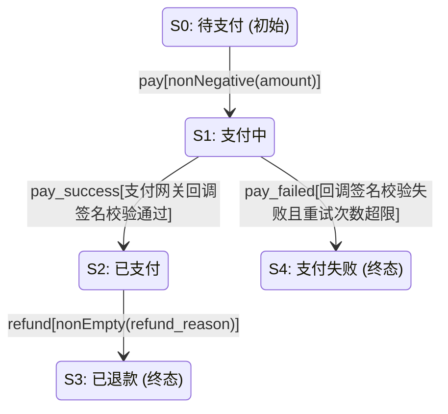

# 支付协议

> 协议版本：**1.0.0** | 检阅时间：2026-08-25T10:41:16.726Z

描述支付从发起、回调成功到退款的完整生命周期；包含 W1-b 关系断言段（三种断言各至少一条）与受限谓词语法守卫（TC1/TC2 实例载体）

## 总览

| 指标 | 值 |
| --- | --- |
| 角色数 | 3 |
| 系统接口 | 4 |
| 观测接口 | 8 |
| 测试用例 | 0 |
| 验证通过 / 失败 | 0 / 0 |

## 快速跳转

- [接口列表](interfaces/) — 12 个接口的请求/响应结构与守卫
- [测试用例浏览器](test-cases) — 路径覆盖度与偏差
- [验证报告对比](verification) — legacy vs impl 双跑对账
- [模型 diff / impact](diff) — 变更 → 受影响步骤/产物

## 状态机图（mermaid）

> 复制上述 mermaid 段落到 <https://mermaid.live> 可渲染。

## 角色

| ID | 名称 | 类型 |
| --- | --- | --- |
| customer | 顾客 | consensus |
| platform | 平台 | participant |
| payment_gateway | 支付网关 | participant |

## 安全边界

- 本产物由 derive-web 机械生成；不含 authConfig.token/secret/password 等敏感字段。
- 本产物不读取 bindings.yaml；不读取进程环境变量。
- P0 范围仅只读展示；编辑能力在 P1 提供。
