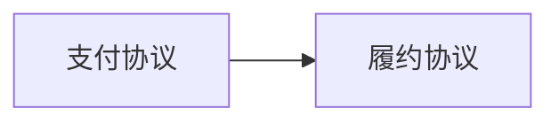

# 系统元数据

```yaml
systemName: 履约-支付组合系统
version: 0.1.0
changeType: protocol_tweak
```

# 子协议清单

```yaml
- protocolId: P1
  name: 履约协议
  version: 1.0.0
  modelPath: protocol/P1/model.md
- protocolId: P2
  name: 支付协议
  version: 1.0.0
  modelPath: protocol/P2/model.md
```

# 依赖图



```yaml
- from: P2
  to: P1
  dependencyType: state
  description: 退款完成是履约取消的前提（履约协议退款转移 guard 引用 P2 退款状态）
```

# 跨协议不变量

### CI1: 退款与履约取消一致

```yaml
id: CI1
name: 退款与履约取消一致
span: [P1, P2]
expression: 订单退款完成（P2.S_refunded）时，履约协议订单必须已取消（P1.S_cancelled）
declaredBy: platform
checkMethod: 跨协议对账：退款记录 vs 履约取消记录
complexity: simple_boolean
```

### CI2: 退款金额不超订单金额

```yaml
id: CI2
name: 退款金额不超订单金额
span: [P1, P2]
expression: 退款累计金额 <= 订单金额
declaredBy: platform
checkMethod: 退款金额汇总比对订单金额
complexity: simple_boolean
```
