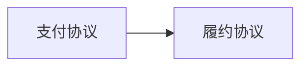

# 履约-支付组合系统 —— 项目总览

> 版本：**0.1.0** | 变更类型：`protocol_tweak` | 检阅时间：2026-08-30T14:14:33.158Z

## 子协议概览

| ID | 名称 | 版本 | 接口数 | 系统+观测 | schema 形态 | 迁移状态 |
| --- | --- | --- | --- | --- | --- | --- |
| P1 | 履约协议 | 1.0.0 | 11 | 4+7 | structured=9 / legacy-stub=2 / description-only=0 |  |
| P2 | 支付协议 | 1.0.0 | 12 | 4+8 | structured=10 / legacy-stub=2 / description-only=0 |  |

## 子协议快速跳转

- [P1 履约协议](protocols/P1/) — 11 个接口
- [P2 支付协议](protocols/P2/) — 12 个接口

## 依赖图（mermaid）

> 复制上述 mermaid 段落到 <https://mermaid.live> 可渲染。

### 依赖边清单（结构化，工具消费权威源）

| From | To | Type | 说明 |
| --- | --- | --- | --- |
| P2 | P1 | state | 退款完成是履约取消的前提（履约协议退款转移 guard 引用 P2 退款状态） |

## 跨协议引用汇总

- 跨协议引用总数：**4**
- `guard` 类引用：**4**

完整清单见 [cross-refs.md](cross-refs)（关联矩阵 + 共享台账 + 双向引用表）。

## 跨协议不变量覆盖

- 跨协议不变量数：**2**
- `CI1` 退款与履约取消一致（span: P1, P2；关联接口 0）
- `CI2` 退款金额不超订单金额（span: P1, P2；关联接口 0）

## 安全边界

- 本产物由 protochain derive-web --project 机械生成
- 不读 process.env / 不读 bindings.yaml / 不调 AI
- 敏感字段（tokenEnv/secretEnv/passwordEnv 等）已在 specs.json envelope 阶段脱敏
