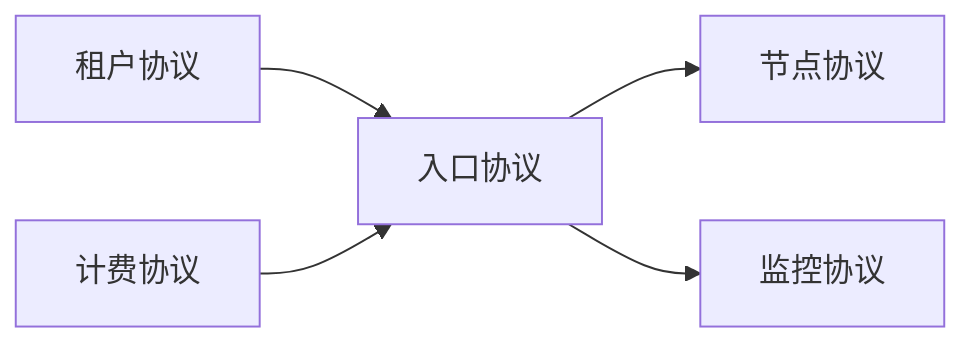

# 系统元数据

```yaml
systemName: SaaS 5 子协议系统
version: 0.1.0
changeType: protocol_tweak
```

# 子协议清单

```yaml
- protocolId: P1
  name: 租户协议
  modelPath: tests/fixtures/saas-P1-tenant.md
- protocolId: P2
  name: 入口协议
  modelPath: tests/fixtures/saas-P2-entry.md
- protocolId: P3
  name: 节点协议
  modelPath: tests/fixtures/saas-P3-node.md
- protocolId: P4
  name: 计费协议
  modelPath: tests/fixtures/saas-P4-billing.md
- protocolId: P5
  name: 监控协议
  modelPath: tests/fixtures/saas-P5-monitor.md
```

# 依赖图



```yaml
- from: P1
  to: P2
  dependencyType: state
  description: 租户存在是入口前提
- from: P2
  to: P3
  dependencyType: state
  description: 入口需要节点承载
- from: P2
  to: P5
  dependencyType: event
  description: 入口状态变更通知监控
- from: P4
  to: P2
  dependencyType: state
  description: 计费状态影响入口操作
```

# 跨协议不变量

### CI1: 端口跨入口独占

```yaml
id: CI1
name: 端口跨入口独占
span: [P2]
expression: not exists(two entries sharing same (server_id, port))
declaredBy: platform
checkMethod: 查询端口分配表
complexity: simple_boolean
```

### CI2: 入口归属有效租户

```yaml
id: CI2
name: 入口归属有效租户
span: [P1, P2]
expression: every entry belongs to an active tenant
declaredBy: platform
checkMethod: 租户-入口关联表校验
complexity: first_order
```

### CI3: 活跃入口必有监控

```yaml
id: CI3
name: 活跃入口必有监控
span: [P2, P5]
expression: every active entry has monitoring enabled
declaredBy: platform
checkMethod: 入口监控关联表校验
complexity: first_order
```

# 跨协议时序

### CT1: 入口创建后监控启用

```yaml
id: CT1
name: 入口创建后监控启用
rule: 入口创建后 60 秒内监控启用
span: [P2, P5]
boundMs: 60000
```

# 外部依赖

### payment_gateway: 支付网关

```yaml
system: payment_gateway
direction: event_sync
protocol: P4
syncSemantics: 事件同步，支付网关推送争议事件
syncCharacteristics:
  - at_most_once
  - event_time_ordering
compensation:
  - 丢弃重复事件
  - 延迟超阈值丢弃
impactOnFailure: 计费争议无法处理
```

# 观测接口

### OI1: 入口状态观测

```yaml
id: OI1
name: 入口状态观测
observer: tenant_admin
scope: P2.entry
permissionBoundary: 仅本租户可见
readOnly: true
observable:
  - protocol: P2
    object: S2
    fields: [traffic_count, port_bound]
    filter: by tenant
```

# 对象状态切面

### entry: 入口对象切面

```yaml
object: entry
idKey: entry.id
facets:
  - protocol: P2
    dimensions: [traffic_count, port_bound]
    description: 入口运行时状态维度
crossFacetConstraints:
  - expression: entry.port_bound implies port exists
    tracesToInvariantId: CI1
```

# 安全前提

### SA1: 租户隔离

```yaml
id: SA1
assumption: 租户间数据隔离
description: 不同租户的入口、节点与监控数据相互隔离
impactIfViolated: 租户数据泄露
```
