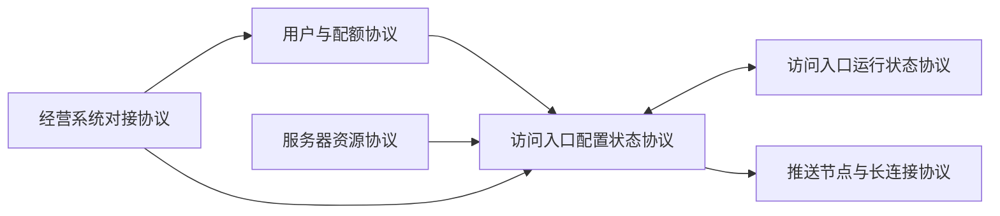

# 系统元数据

```yaml
systemName: SaaS 内网映射系统
version: 1.0.0
changeType: protocol_tweak
```

# 子协议清单

```yaml
- protocolId: P1
  name: 用户与配额协议
  version: 1.0.0
  modelPath: tests/fixtures/saas-real-P1-user.md
- protocolId: P2
  name: 访问入口配置状态协议
  version: 1.0.0
  modelPath: tests/fixtures/saas-real-P2-entry-config.md
- protocolId: P3
  name: 访问入口运行状态协议
  version: 1.0.0
  modelPath: tests/fixtures/saas-real-P3-entry-runtime.md
- protocolId: P4
  name: 推送节点与长连接协议
  version: 1.0.0
  modelPath: tests/fixtures/saas-real-P4-push-node.md
- protocolId: P5
  name: 服务器资源协议
  version: 1.0.0
  modelPath: tests/fixtures/saas-real-P5-resource.md
- protocolId: P6
  name: 经营系统对接协议
  version: 1.0.0
  modelPath: tests/fixtures/saas-real-P6-billing.md
```

# 依赖图



```yaml
- from: P1
  to: P2
  dependencyType: state
  description: 用户配额状态决定能否创建新入口，用户锁定后入口需停用
- from: P2
  to: P3
  dependencyType: state
  description: P2 配置状态决定 P3 运行状态是否生效，配置状态变化触发 P3 实例清理
- from: P3
  to: P2
  dependencyType: event
  description: 运行状态变化（如实例断开）反映到入口综合状态展示
- from: P2
  to: P4
  dependencyType: event
  description: 入口状态变更通过绑定的推送节点推送通知
- from: P5
  to: P2
  dependencyType: state
  description: P5 的服务器端口资源池为 P2 入口分配域名+端口资源
- from: P6
  to: P1
  dependencyType: event
  description: 经营系统推送用户锁定/解锁事件，P1 响应用户状态变化
- from: P6
  to: P2
  dependencyType: event
  description: 经营系统推送配额变更事件，P2 响应入口冻结/关闭/恢复
```

# 跨协议不变量

### CI1: 入口归属有效用户

```yaml
id: CI1
name: 入口归属有效用户
span: [P1, P2]
expression: "every entry belongs to a valid (non-locked) user"
declaredBy: user
complexity: first_order
checkMethod: 用户-入口关联表校验
```

### CI2: 活跃入口必有转发实例

```yaml
id: CI2
name: 活跃入口必有转发实例
span: [P2, P3]
expression: "entry.config_state = enabled implies entry.runtime_state = normal"
declaredBy: user
complexity: first_order
checkMethod: 入口配置状态与运行状态比对
```

### CI3: 端口跨入口独占

```yaml
id: CI3
name: 端口跨入口独占
span: [P2, P5]
expression: "not exists(two non-terminal entries sharing same (server_id, port))"
declaredBy: operator
complexity: first_order
checkMethod: 查询端口分配表
```

### CI4: 锁定用户入口不得启用

```yaml
id: CI4
name: 锁定用户入口不得启用
span: [P1, P2]
expression: "user.state = locked implies forall entry: entry.config_state != enabled"
declaredBy: user
complexity: first_order
checkMethod: 用户锁定状态与入口配置状态联合查询
```

### CI5: 连接不可冒充

```yaml
id: CI5
name: 连接不可冒充
span: [P3, P4]
expression: "not exists(impersonated tunnel_connection or push_connection)"
declaredBy: user
complexity: first_order
checkMethod: 连接认证审计检查
```

### CI6: 配额不超限

```yaml
id: CI6
name: 配额不超限
span: [P1, P2]
expression: "user.non_terminal_entry_count <= sum(quota_package.entry_cap)"
declaredBy: user
complexity: first_order
checkMethod: 用户入口计数与配额上限比对
```

# 跨协议时序

### CT1: 用户锁定后入口停用

```yaml
id: CT1
name: 用户锁定后入口停用
rule: 用户锁定后 T_lockdown 内完成入口停用
span: [P1, P2]
boundMs: T_lockdown
```

### CT2: 流量耗尽后入口关闭

```yaml
id: CT2
name: 流量耗尽后入口关闭
rule: 流量配额耗尽后 T_quota_exhaust 内入口进入已关闭态
span: [P1, P2]
boundMs: T_quota_exhaust
```

### CT3: 冻结超时归档

```yaml
id: CT3
name: 冻结超时归档
rule: 入口进入已冻结态超过 7 天后进入已归档态
span: [P2]
boundMs: 604800000
```

### CT4: 配额减少后暂停超额入口

```yaml
id: CT4
name: 配额减少后暂停超额入口
rule: 配额减少后 T_quota_decrease 内暂停超额入口
span: [P1, P2]
boundMs: T_quota_decrease
```

# 外部依赖

### billing_system: 经营系统

```yaml
system: billing_system
direction: event_sync
protocol: P6
syncSemantics: 事件同步，经营系统推送用户与配额变更事件
syncCharacteristics:
  - at_least_once
  - event_time_ordering
  - possible_delay
compensation:
  - 事件去重（幂等消费）
  - 延迟事件继续处理
  - 经营系统恢复后回溯校验
impactOnFailure: 配额数据可能滞后，但现有入口继续运行
```

# 观测接口

### OI1: 入口状态观测

```yaml
id: OI1
name: 入口状态观测
observer: user
scope: P2.entry
permissionBoundary: 仅本用户可见
readOnly: true
observable:
  - protocol: P2
    object: P2
    fields: [config_state, domain, port, quota_package, access_control]
    filter: by user
  - protocol: P3
    object: P3
    fields: [runtime_state]
    filter: by entry
```

### OI2: 用户配额观测

```yaml
id: OI2
name: 用户配额观测
observer: user
scope: P1.user
permissionBoundary: 仅本用户可见
readOnly: true
observable:
  - protocol: P1
    object: P1
    fields: [user_state, quota_packages, traffic_quota]
    filter: by user
```

### OI3: 运营方全观测

```yaml
id: OI3
name: 运营方全观测
observer: operator
scope: 全系统
permissionBoundary: 运营方可见
readOnly: true
observable:
  - protocol: P1
    object: P1
    fields: [all]
    filter: none
  - protocol: P2
    object: P2
    fields: [all]
    filter: none
  - protocol: P5
    object: P5
    fields: [all]
    filter: none
  - protocol: P5
    object: P5
    fields: [all]
    filter: none
  - protocol: P5
    object: P5
    fields: [all]
    filter: none
```

### OI4: 经营系统查询

```yaml
id: OI4
name: 经营系统查询
observer: billing_system
scope: 指定用户
permissionBoundary: 仅查询自己名下用户
readOnly: true
observable:
  - protocol: P1
    object: P1
    fields: [user_state, quota_packages, traffic_usage]
    filter: by billing_customer
  - protocol: P2
    object: P2
    fields: [config_state, traffic_stats]
    filter: by user
```

# 对象状态切面

### entry: 入口对象切面

```yaml
object: entry
idKey: entry.id
facets:
  - protocol: P2
    dimensions: [config_state, domain, port]
    description: 入口配置状态维度
  - protocol: P3
    dimensions: [runtime_state]
    description: 入口运行状态维度
crossFacetConstraints:
  - expression: entry.config_state=已启用 implies entry.runtime_state must be defined
    tracesToInvariantId: CI2
```

### server: 服务器对象切面

```yaml
object: server
idKey: server.id
facets:
  - protocol: P5
    dimensions: [operational_state, capacity, ports]
    description: 服务器资源状态维度
crossFacetConstraints: []
```

# 安全前提

### SA1: 连接不可冒充

```yaml
id: SA1
assumption: 隧道连接和消息推送连接不可被第三方冒充
description: 即使攻击者知道用户信息，也不能伪造连接
impactIfViolated: 用户入口流量被劫持或推送通知被拦截
tracesToInvariantId: CI5
```

### SA2: 资源不重复分配

```yaml
id: SA2
assumption: 域名+端口组合不被重复分配给多个入口
description: 每个非终态入口独占一个域名+端口组合
impactIfViolated: 端口冲突导致入口转发异常
tracesToInvariantId: CI3
```

### SA3: 配额不超限

```yaml
id: SA3
assumption: 用户入口数和流量消耗不超过配额上限
description: 用户的入口数、流量消耗不能超过配额包上限
impactIfViolated: 资源过度占用影响其他用户
tracesToInvariantId: CI6
```
